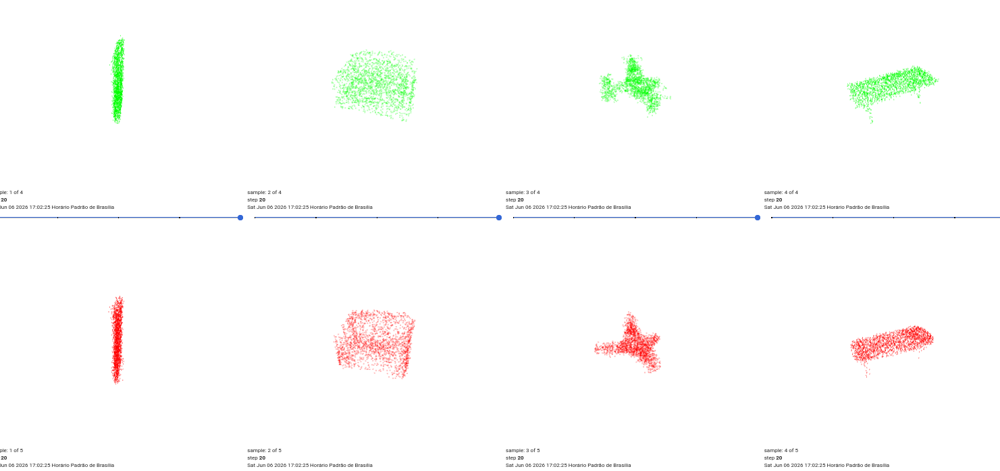
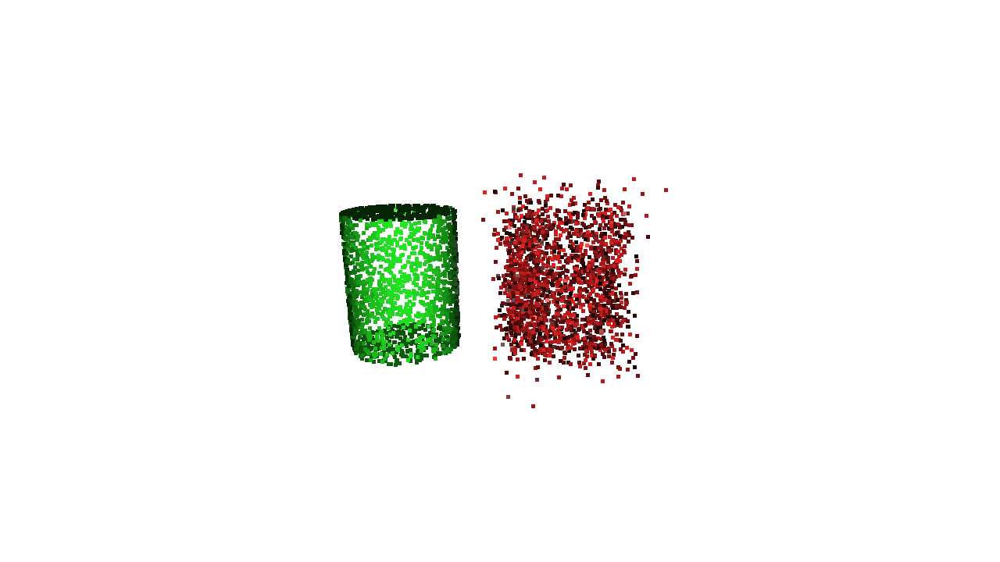
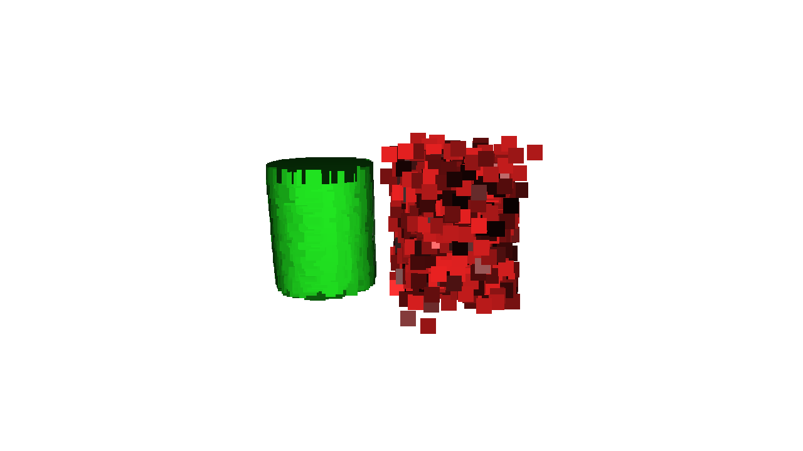
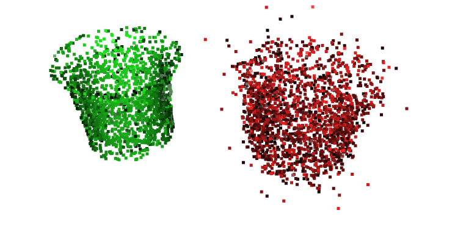
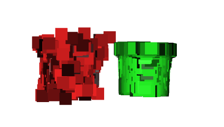
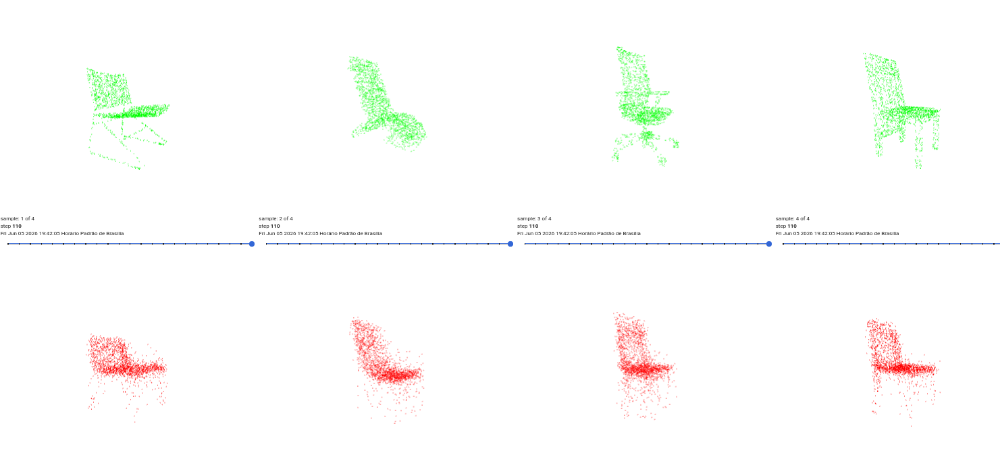

# 3D_MeshGen

A Diffuse Latent Model in Shapenet dataset

## Arquitetura (Architecture)

O modelo adota uma abordagem de duas fases (2-stage) para a geração de nuvens de pontos 3D: um **Autoencoder Variacional (VAE)** e um **Modelo de Difusão Latente**.

### 1. Variational Autoencoder (VAE)
A arquitetura do VAE (`VaeFlat`) é desenvolvida para aprender um espaço latente "flat" (um vetor único, sem divisões local/global).
- **Encoder (`GlobalEncoder`)**: Processa nuvens de pontos (ex. 2048 pontos) usando Convoluções Point-Voxel (PVConv) em múltiplos estágios (downsampling). O objetivo é extrair características e gerar a média e a variância para amostrar um vetor latente representativo (padrão de 512 dimensões).
- **Decoder (`FlatDecoder`)**: Utiliza uma arquitetura inspirada no *StyleGAN*. Ele parte de um *canvas* constante (conjunto fixo de âncoras/sementes) e aplica deformações sucessivas condicionadas pelo vetor latente através de **AdaGN (Adaptive Group Normalization)**. A ausência de pressões de *folding* complexas torna a rede mais direta na geração espacial.

### 2. Modelo de Difusão no Espaço Latente
Ao invés de rodar a difusão diretamente nas nuvens de pontos 3D, ela ocorre no espaço latente compactado do VAE.
- **Rede Denoising (`UNet1D`)**: Uma U-Net 1D composta por blocos residuais 1D (`ResBlock1D`) e camadas de Autoatenção Multi-head (`AttnBlock1D`). Ela é condicionada pelo *time embedding*.
- **Difusão e Amostragem**: Baseia-se em um *Cosine Schedule* para gerenciar a adição de ruído (1000 passos no treinamento DDPM). A geração de amostras na inferência utiliza amostragem **DDIM** (com apenas 200 passos) para alcançar resultados rápidos.

---

## Método de Treinamento

O treinamento é feito em duas etapas independentes, utilizando *Automatic Mixed Precision (AMP)* em GPU para maior eficiência computacional.

### Estágio 1: Treinamento do VAE (`train_vae_flat.py`)
- O VAE é treinado inicialmente para maximizar a qualidade da reconstrução da nuvem de pontos 3D.
- **Função de Perda de Reconstrução**: É utilizada uma combinação ponderada de **Chamfer Distance (CD)** e **Earth Mover's Distance (EMD)**.
- **Estratégia contra Colapso do KL**: Modelos VAE frequentemente ignoram a representação latente se a penalidade (divergência KL) for muito severa cedo demais. Para mitigar isso, o modelo utiliza:
  - **Free-bits Threshold**: Define um valor mínimo de divergência aceito por canal latente, relaxando a penalização para canais que contém informações ativas da geometria.
  - **KL Annealing**: O peso da divergência KL (`beta`) começa em zero (`beta_start = 0`), é mantido em 0 por um período predeterminado (`beta_hold_epochs`), e então cresce gradativamente até 1. Isso garante que o *decoder* construa dependência das variáveis latentes antes da restrição ser ativada na sua totalidade.

### Estágio 2: Treinamento do Modelo de Difusão (`train_diffusion.py`)
- **Pré-processamento Latente**: Com os pesos do VAE congelados e isolados, todas as nuvens de pontos do treinamento são mapeadas pelo *Encoder* do VAE, extraindo os valores de $\mu$ (média) e $\sigma$ (desvio padrão) para cada amostra.
- Durante o treinamento da difusão, trabalha-se primariamente sobre os *means* ($\mu$), aplicando um pequeno ruído (jittering) em tempo real, sem extrair amostras do posterior, para evitar o overfitting e facilitar o aprendizado da rede U-Net.
- **Função de Perda da Difusão**: O modelo é penalizado minimizando o **Erro Quadrático Médio (MSE)** entre a previsão do ruído da U-Net e o ruído verdadeiro injetado num timestep `t`, ponderado por uma curva regulada pelo *Signal-to-Noise Ratio (SNR)*.
- **EMA (Exponential Moving Average)**: É mantida uma média móvel exponencial sob os pesos do otimizador (*AdamW*) e modelo de difusão para estabilizar a rede e maximizar o desempenho (avaliado periodicamente com métricas de MMD, COV e 1-NNA).

---

## Current State [main]

## I need To

0 - COMPARE RESULTS AND STUDY MORE ABOUT THE LATENT OVERFLOW (blue clouds)

1 - Solve Loss Stagnation (Normals) (EMD)

2 - Take care with KL collapse

3 - Init Gan structure (Need I?)

4 - Init Diffuse Latent (Estudy Diffuse for latent_point LION)

5 - Nksr Incorpore (Maybe SAP)

## History:

### First: [The model can be finded in branch VIT_init]

Simple VAE with PointNet encoder and PointNet decoder. The loss is the Chamfer Distance between the input point cloud and the output point cloud. The model is trained on the Shapenet dataset, only one batch for training.

Results:

----------------------------------------------------------------------------------------------------

### Second: [The model can be finded in branch test]

The model is the same as the first one, but with a more robust MLP decoder. The loss is the Chamfer Distance between the input point cloud and the output point cloud. The model is trained on the Shapenet dataset, only one batch for training.

    
    

    
    

### Third: [The model can be finded in branch pvcnn]

A Implementation of LION Nvidia Model

### Fourth: [The model can be finded in branch pvcnn_entiredata]

Entire ShapeNetCore incorporation

</img>

