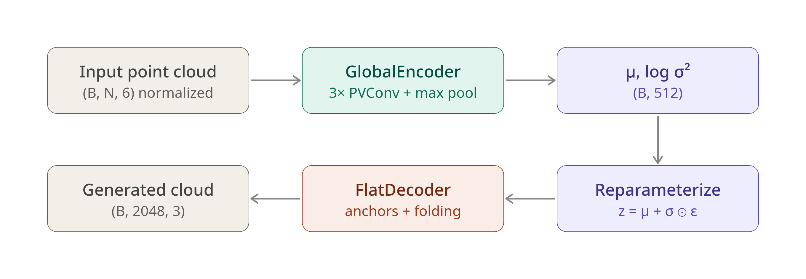

# **3D Mesh Gen**

🎯 
The goal of this repository is to construct a Stable Diffusion Model for 3D Meshes Generation

## Dataset

## The Model:

### VAE

The VAE part uses a [PVCNN architeture](https://doi.org/10.48550/arxiv.1907.03739)

<figure>
  
  <figcaption>High Level VAE Structure.</figcaption>
</figure>

### Diffusion

## Metrics:

## Results:

## Why?